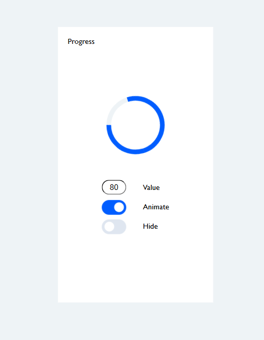
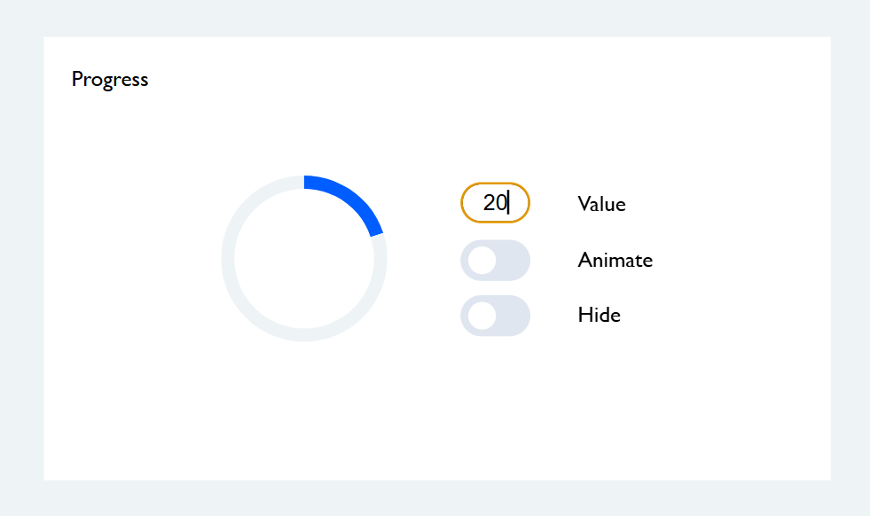

<h1>Тестовое задание Progress</h1>

Проект написан с использованием js, css(scss), html. <br>
На главной странице находится блок, который состоит из заголовка "Progress", круговрй диаграммы и блока с состояниями. <br>
Блок с состояниями включает в себя: <br>
1. Normal - представляет собой input типа number, ограниченный от 0 до 100.<br>
2. Animated -  представляет собой switch (checkbox), состояния false/true. <br>
3. Hidden -  представляет собой switch (checkbox), состояния false/true. <br>

Ниже прикреплены скриншоты первой страницы.<br>




<h1>Классы CSS</h1>

- .progress__bar - основной контейнер прогресс-бара
- .left - левая половина прогресс-бара
- .right - правая половина прогресс-бара
- .spinner - элементы, отображающие прогресс
- .slider - элемент, переключения состояния
- .spin - класс для включения анимации вращения
- .hide - класс для скрытия прогресс-бара

<br/>
<h1>API компонента</h1>

## Функция progressBarBreeding(value, leftSpinner, rightSpinner, previousValue)
Обновляет отображение прогресс-бара в соответствии с переданным значением.<br>

*Параметры:*

- value (Number): значение прогресса (0-100)

- leftSpinner (HTMLElement): элемент левого спиннера

- rightSpinner (HTMLElement): элемент правого спиннера

- previousValue (Number): предыдущее значение прогресса 

*Принцип работы:*

Определяет направление изменения (увеличение/уменьшение)

Для значений 0-50:

- Анимирует только правый спиннер

- Левый спиннер остается в начальном положении (-45deg)

Для значений 50-100:

- Фиксирует правый спиннер в положении 135deg

- Анимирует левый спиннер с задержкой 300ms

При уменьшении значений используется обратная логика

## Функция toggleClass(progress, className)
Переключает класс у элемента прогресс-бара.

*Параметры:*

- progress (HTMLElement): элемент прогресс-бара

- className (String): имя класса для переключения ('spin' или 'hide')

<br>
<h1>Основной компонент</h1>

Импорт функций из API.js:
```
import { progressBarBreeding, toggleClass } from './API.js';
```
Получение всех элементов необходимых для управления диаграммой с html:
```
const progress = document.querySelector('.progress__bar');
const leftSpinner = document.querySelector(".left .spinner");
const rightSpinner = document.querySelector(".right .spinner");

const currentValue = document.querySelector("#current-value");
const animateBtn = document.querySelector("#animate__btn");
const hideBtn = document.querySelector("#hide__btn");
```

Проверка на введенное число из input для отображения графика. Если число меньше нуля, больше 100 или длина более 3 элементов, то в элемент input передается null и сбрасывается отрисовка графика. В противном случае вызывается функция progressBarBreeding из API для отрисовки графика:

```
const checkValueInput = (value) => {
    if(value < 0 || value > 100 || value.length > 3) {
        currentValue.value = null;
        progressBarBreeding(0, leftSpinner, rightSpinner);
        return;
    }
    progressBarBreeding(value, leftSpinner, rightSpinner);
}
```
Прослушиватели событий для switch и input:
```
currentValue.addEventListener("input", (e) => checkValueInput(e.target.value))
animateBtn.addEventListener("change",() => toggleClass(progress, "spin"))
hideBtn.addEventListener("change",() => toggleClass(progress, "hide"))
```